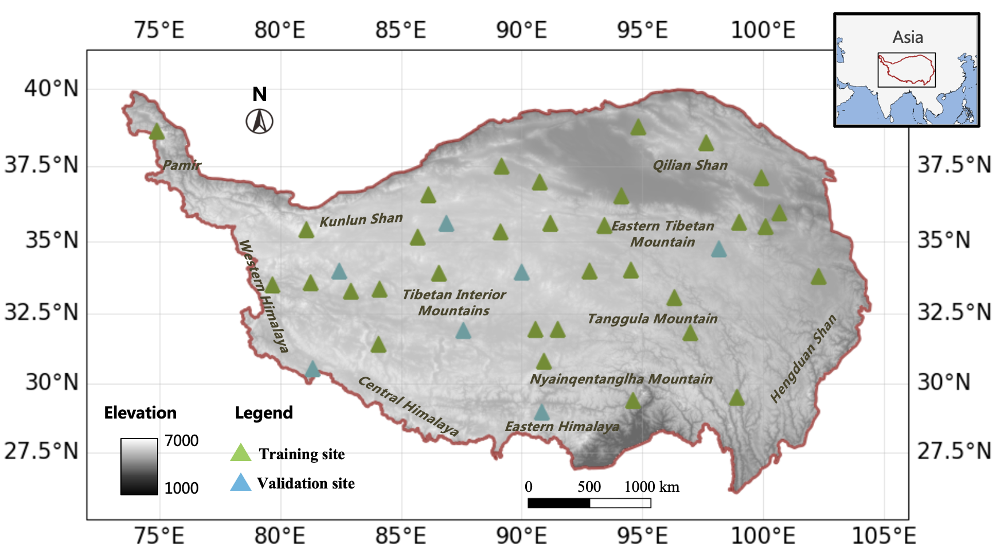
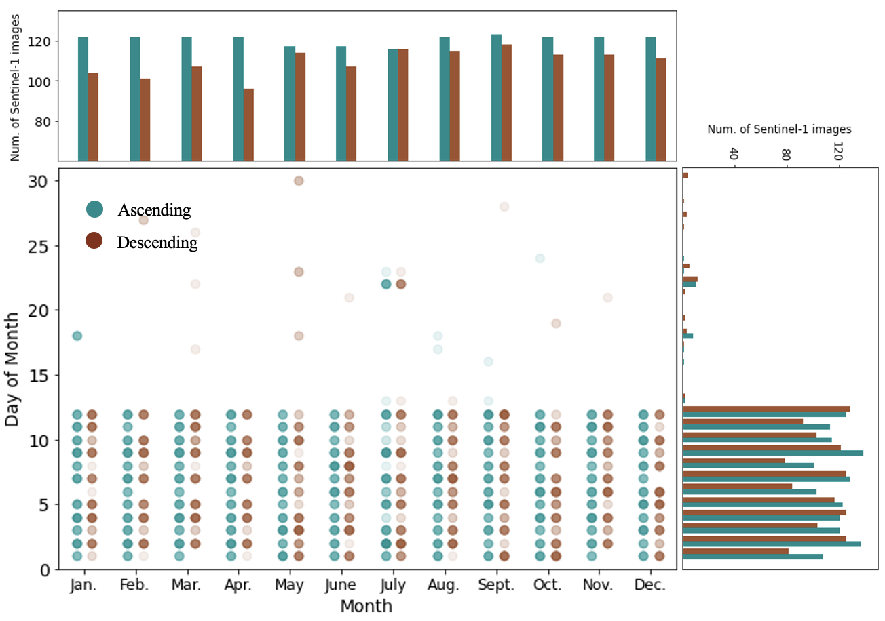
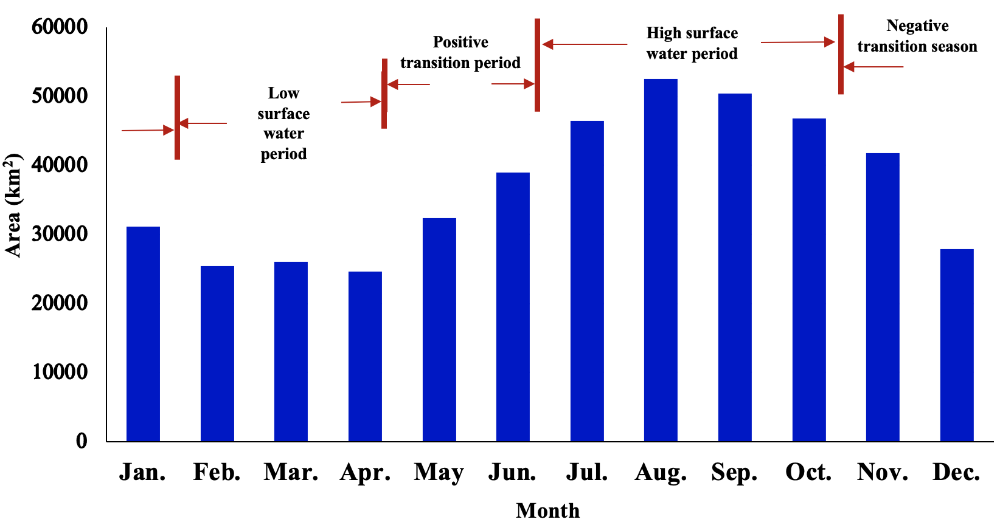
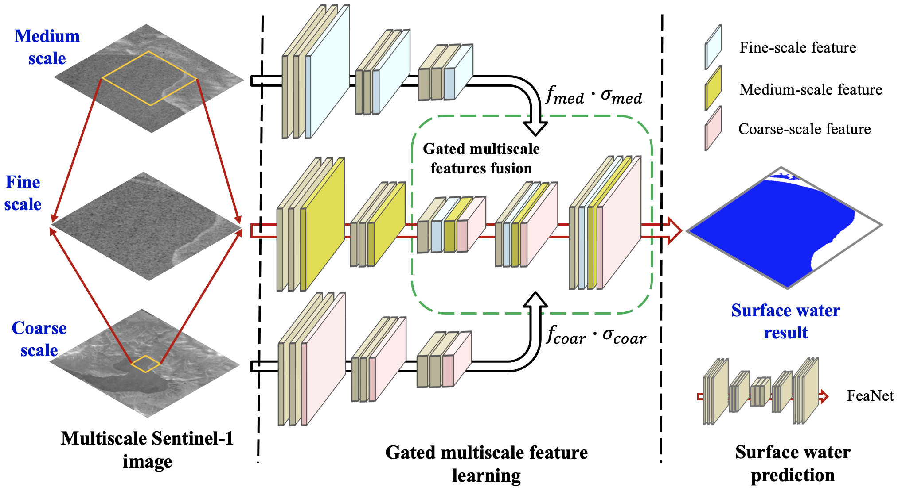

# Tibet-Water-2020
We produce monthly surface water maps in Tibet plateau in 2020 by using deep learning method and Sentinel-1 image.

## Highlights
- We proposed a new gated multiscale ConvNet (GMNet) for surface water mapping based on Sentinel-1 image.
- The monthly surface water dynamics are captured by using the new proposed GMNet.

## Study area and data
|Study area|Sentinel-1 imagery|
|:--|:--| 
|||

## Monthly surface water dynamics 
- Monthly surface water maps

- Monthly surface water trend

## GMNet structure

## How to use the GMNet for surface water mapping?
### -- Step 1
- Enter the following commands for downloading the code files, and then configure the python and deep learning environment. The deep learning software used in this repo is [Pytorch](https://pytorch.org/).

  ~~~console
  git clone  https://github.com/xinluo2018/Tibet-Water-2020.git
  ~~~

### -- Step 2
- Download Sentinel-1 images, acending image only, descending image only, or both the ascending and descending images. if both the ascending and descending images are used for surface water mapping, the ascending and descending images should be croped to the same size.

### -- Step 3
- Add the prepared sentinel-1 image to the **_data/test-demo_** directory, modify the data name in the **_notebooks/infer_demo.ipynb_** file, then running the code file: **_notebooks/infer_demo.ipynb_** and surface water map can be generated. The users can run the **_notebooks/infer_demo.ipynb_** without any modification to learn how the surface water map is generated based on the provided test images.
- Users also can specify surface water mapping by using the gmnet_infer.py, specifically,  
- --- funtional API:
  ~~~python
  from scripts.gmnet_infer import gmnet_infer   
  path_model_as_w =' model/trained_model/scales/unet_scales_gate/dset/as/model_1_weights.pth'
  path_model_des_w = 'model/trained_model/scales/unet_scales_gate/dset/des/model_1_weights.pth'
  path_model_w = 'model/trained_model/scales/unet_scales_gate/dset/as_des/model_1_weights.pth'
  ### The s1_as, s1_des and s1_stacked is the Sentinel-1 images of np.array() type.
  wat_pred_as = gmnet_infer(s1_as, path_model_as_w, orbit='as')  ### using s1 ascending image only
  wat_pred_des = gmnet_infer(s1_des, path_model_des_w, orbit='des')  ### using s1 descending image only
  wat_pred = gmnet_infer(s1_stacked, path_model_w, orbit='as_des') ### using both ascending and descending images
  ~~~
- --- command line API:
  ~~~console
  ### using s1 ascending image only
  path_model_as_w=model/trained_model/scales/unet_scales_gate/dset/as/model_1_weights.pth
  path_s1_as=data/test_demo/s1as.tif
  path_out_dir=data/test_demo
  python scripts/gmnet_infer.py -m $path_model_as_w -img $path_s1_as -orbit as -o $path_out_dir -s 1

  ### using s1 descending image only
  path_model_des_w=model/trained_model/scales/unet_scales_gate/dset/des/model_1_weights.pth
  wat_pred_des = gmnet_infer(s1_des, path_model_des_w, orbit='des')   ### for s1 descending image only
  path_out_dir=data/test_demo
  python scripts/gmnet_infer.py -m $path_model_des_w -img $path_s1_des -orbit des -o $path_out_dir -s 1

  ### using both ascending and descending images
  path_model_w =model/trained_model/scales/unet_scales_gate/dset/as_des/model_1_weights.pth
  path_s1_stacked=data/test_demo/s1_stacked.tif
  path_out_dir=data/test_demo
  python scripts/gmnet_infer.py -m $path_model_w -img $path_s1_stacked -orbit as_des -o $path_out_dir -s 1
  ~~~

## -- Citation
- Xin Luo, Zhongwen Hu, Lin Liu. Investigating the seasonal dynamics of surface water over the Qinghai–Tibet Plateau using Sentinel-1 imagery and a novel gated multiscale ConvNet.